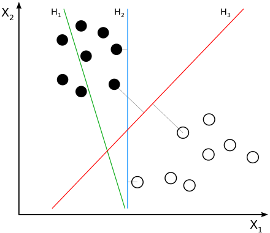

## Introduction Machine Learning

From Wikipedia:

>Machine learning algorithms build a mathematical model of sample
>data, known as "training data", in order to make predictions or
>decisions on new data without being explicitly programmed to perform
>the task.

Lineair regression can be considered as a simple form of machine learning. Probably you have used linear regression (the `lm` command in R) for hypothesis testing. When you have established the `intercept a` and the `slope b`, you have a model to predict a new dependent variable `y'` when you fill a new independent variable `x'` into the formula `y' = a + b*x'`

Another type of machine learning is a Neural Network which, at the moment, has widely attracted full attention of scientists in all kinds of disciplines. But we are going to use another very powerfull Machine Learning algorithm: **Support Vector Machines (SVM)**

The idea behind SVM is to represent the observations or samples as points in a p-dimensional space and, then, to find the p-1 dimensional plane which creates the greatest separation between the points according to some classification. See picture below for a 2-dim case; higher dimensions are difficult to draw. Hyperplane H3 best divides the black and white points.

Non lineair classification can be achieved with a kernel trick. See picture below. A function ø (a.k.a. kernel) maps the points in such a way that they are lineairly separable. This will often lead to points in a higher dimensional space.

