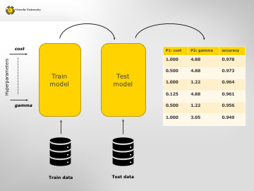
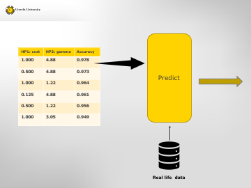

---
output:
  html_document: default
  pdf_document: default
---

## Problem description

In this workshop we use an example from Machine Learning. The goal of this lesson is how to run many programs (or parts of programs) in parallel, so it is not necessary to understand the principles of the Machine Learning algorithm. Therefore the code that does the machine learning is considered as a **black box**. The box has a set of training data that is used to estimate model parameters, some input parameters and one output (the model). See picture.



The type of models we are using is Support Vector Machines (SVM). If you are curious, see [intro ml](./intro_ml.md) for more information. But it isn't necessary to know how SVM works.

In our example we will develop a model for an automated postal service that is able to recognize hand-written addresses. The training data consists of 3823 images of hand-written digits composed of 8x8 pixels and 16 grey levels. This training data is already classified, so from every image it is known which digit it represents. In ML language we say that the training data is labeled. With these data the model is trained to recognize digits.

In ML the input parameters are called **hyperparameters**. These paramaters alter the training algorithm in some way. In our example we have two paramaters 'cost' and 'gamma'. The meaning of these parameters is not relevant at the moment. Our problem is to find the combination of parameter values that gives the best model.

In this case **best model** is the model with the highest **accuracy**. Every trained model is tested with a seperate dataset of 1797 labeled images. Here, accuracy has been defined as the fraction of correct predicted digits. 

At the end we contruct a table showing the accuracy for every parameter combination. We will stop here, but from this table it is possible to select the best model and use it on new unlabeled data. E.g. for recognizing zip codes in an automated postal service.



Our job ends when we have constructed the accuracy table. Maybe you have already observed that the problem of finding the best model is **pleasingly parallel**.  We construct a **grid** of all parameter combinations and in this grid we **search** for the parameter combination that gives the best model. Hence the term **grid search**.


## Training a Support Vector Machine in RStudio on your local computer

We are going to train a SVM model written in R on your local computer. In the proces of training the model with a lot of different parameter settings, we will see why we eventually need to migrate to a computer cluster. But first we have to download the scripts and data.

### Download course material from GitHub

All the documents and scripts belonging to this workshop are stored in a GitHub repo [Workshop-IRAS](https://github.com/UtrechtUniversity/Workshop-IRAS).

This repo is public and you can download the repository in a `.zip` file on your desktop. Sometimes your local computer will unzip the file immediately. If you are familiar with GitHub, you can also fork/clone the repo, but for this workshop it is not necessary to have these sources in a local git repo.

Download a `.zip` file of  this repo in a folder on your local workstation. Unzip the file and it wil make a folder `Workshop-IRAS-master`. Change that name into `Workshop-IRAS`. Later on in the workshop you will learn how to copy these file to your account on **Lisa**.


### Prepare R and RStudio

We assume you have installed R and RStudio on your local workstation. Install the following packages.

```
install.packages('tidyverse')  # functions for data cleaning
install.packages('e1071')      # functions for modeling/training with SVM
install.packages('raster')     # raster data structure 
```
In RStudio, choose as working directory the folder Workshop-IRAS in which the contents of the repo is copied.

```
setwd("<path to folder>/Workshop-IRAS/")
```

### Train one SVM model on the dataset of labeled images

Open the file `./R/digits_svm_IDE.R` in the _editor_ of RStudio. Go step by step (ctrl-R) through the code and see what happens. Read the comments in the code. The model was trained in ~7 seconds and has an accuracy of ~85%. For an automated postal service such an accuracy will not be acceptable.

### Apply a grid search to get a model with a better accuracy

To find a better accuracy, we are going to do a grid search. Several combinations of hyperparameter settings are tried and then we can select the parameter setting with the best accuracy. 

Load the file `./R/digits_svm_IDE_gs.R` in the _editor pane_ of RStudio. Run the programm step by step (Ctrl-R)

We have now found a better model with accuray of ~97%. Which in fact is still pretty bad if you want to run a fully automated postal service.

We have tried 12 hyperparameter settings and it took ~ 50 seconds. It's probably not a problem for you to wait a minute. But what if we have to try thousands or tenthousands of different settings and the training of each model will take a few minutes. Then it would take days on a local computer. During that time your machine will be too slow for you to do other work in the mean time. 

The nice thing about this kind of ML programs is that every model setting can be tried independently. And that opens a way to reduce the lead time if we can run many models in parallel. Many other scientific programs exhibit the same characteristic

If we want to do a grid search with n parameter settings and we have to run the models sequentially, the lead time will be `n * D` where D (duration) is the time needed for training one model. But if we have N machines (cores), we can set up N streams in parallel and the lead time will be reduced with a factor of approximately `n/N`.

We are going to explore this on LISA, a super computer with ~7500 cores, although we aren't going to use them all.

So many cores on one machine is a huge advantage, but a super computer also has disadvantages. For instance you don't have a nice _interactive development environment (IDE)_ as RStudio on Lisa. But how do we run R code on Lisa?

You will learn that in the next lesson. [Go back to the overview](./overview.md) or go [to the next lesson](./preparations.md).


