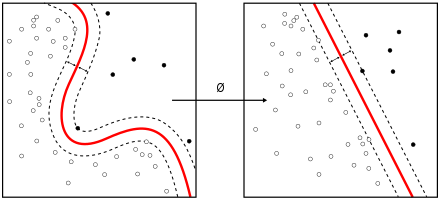

---
output:
  html_document: default
  pdf_document: default
---
## Introduction Machine Learning

From Wikipedia:

>Machine learning algorithms build a mathematical model of sample
>data, known as "training data", in order to make predictions or
>decisions on new data without being explicitly programmed to perform
>the task.

Lineair regression can be considered as a simple form of machine learning. Probably you have used linear regression (the `lm` command in R) for hypothesis testing. When you have established the `intercept a` and the `slope b`, you have a model to predict a new dependent variable `y'` when you fill a new independent variable `x'` into the formula `y' = a + b*x'`


Another type of machine learning is a Neural Network which, at the moment, has widely attracted full attention of scientists in all kinds of disciplines. But we are going to use another very powerfull Machine Learning algorithm: **Support Vector Machines (SVM)**

The idea behind SVM is to represent the observations or samples as points in a p-dimensional space and, then, to find the p-1 dimensional plane which creates the greatest separation between the points according to some classification. See picture below for a 2-dim case; higher dimensions are difficult to draw. Hyperplane H3 best divides the black and white points.


Non lineair classification can be achieved with a kernel trick. See picture below. A function ø (a.k.a. kernel) maps the points in such a way that they are lineairly separable. This will often lead to points in a higher dimensional space.



## Training a Support Vector Machine in RStudio on your local computer

We are going to train a SVM model written in R on your local computer. In the proces of training the model with a lot of different parameter settings, we will see why we eventually need to migrate to a computer cluster. But first we have to download the scripts and data.

### Download course material from GitHub

All the documents and scripts belonging to this workshop are stored in a GitHub repo [Workshop-IRAS](https://github.com/UtrechtUniversity/Workshop-IRAS).

This repo is public and you can download the repository in a `.zip` file on your desktop. Sometimes your local computer will unzip the file immediately. If you are familiar with GitHub, you can also fork/clone the repo, but for this workshop it is not necessary to have these sources in a local git repo.

Download a `.zip` file of  this repo in a folder on your local workstation. Unzip the file and it wil make a folder `Workshop-IRAS-master`. Change that name into `Workshop-IRAS`. Later on in the workshop you will learn how to copy these file to your account on **Lisa**.


### Prepare R and RStudio

We assume you have installed R and RStudio on your local workstation. Install the following packages.

```
install.packages('tidyverse')  # functions for data cleaning
install.packages('e1071')      # functions for modeling/training with SVM
install.packages('raster')     # raster data structure 
```
In RStudio, choose as working directory the folder Workshop-IRAS in which the contents of the repo is copied.

```
setwd("<path to folder>/Workshop-IRAS/")
```

### Train one SVM model on the famous MNIST dataset

Open the file `./R/digits_svm_IDE.R` in the _editor_ of RStudio. Go step by step (ctrl-R) through the code and see what happens. Read the comments in the code. The model was trained in ~7 seconds and has an accuracy of ~85%. 

If a mail sorting process of a postal service would have such an accuracy in recognizing hand-written digits, that company should close its doors.

### Apply a grid search to get a model with a better accuracy

To find a better accuracy, we are going to do a grid search. Several combinations of hyperparameter settings are tried and then we can select the parameter setting with the best accuracy. 

Load the file `./R/digits_svm_IDE_gs.R` in the _source pane_ of RStudio. Run the programm step by step (Ctrl-R)

We have now found a better model with accuray of ~97%. Which in fact is still pretty bad if you would want to run a fully automated postal service.

We have tried 12 hyperparameter settings and it took ~ 50 seconds. It's probably not a problem for you to wait a minute. 

But what if we have to try thousands or tenthousands of different settings and the training of one model will take a few minutes. Then it would take days on a local computer. During that time your machine will be pretty slow or completely confiscated. 

The nice thing about this kind of ML programs is that every model setting can be tried independently. And that opens a way to reduce the lead time if we can run lots of models in parallel. Many other scientific programs exhibit the same characteristic

If we want to do a grid search with n parameter settings and we have to run the models sequentially, the lead time will be `n * D` where D (duration) is the time needed for training one model. But if we have N machines (cores), we can set up N streams in parallel and the lead time will be reduced with a factor of approximately `n/N`.

We are going to explore this on LISA, a super computer with ~7500 cores, although we aren't going to use them all.

So many cores on one machine is a huge advantage, but a super computer also  disadvantages. For instance you don't have a nice _interactive development environment (IDE)_ as RStudio on Lisa. But how do we run R code on Lisa?

You will learn that in the next lesson. [Go back to the overview](./overview.md) or go [to the next lesson](./preparations.md).


