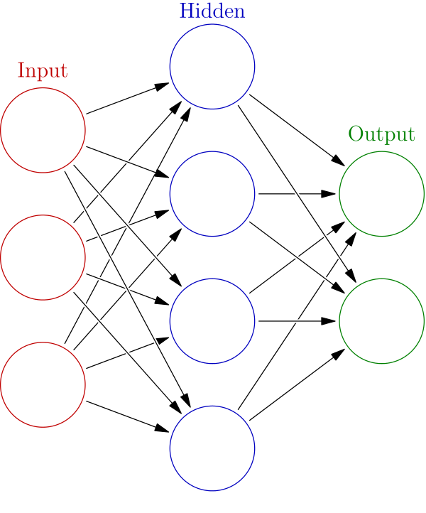
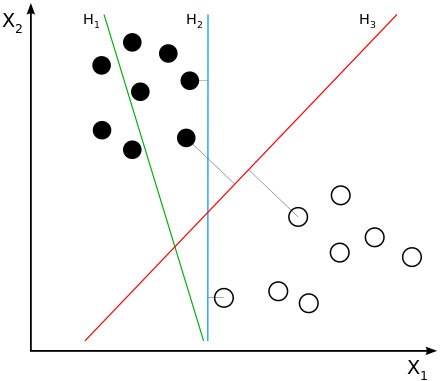

---
output:
  html_document: default
  pdf_document: default
---
## Introduction Machine Learning

Machine learning algorithms build a mathematical model of sample data, known as "training data", in order to make predictions or decisions without being explicitly programmed to perform the task.

Lineair regression
* very simple but quite useless in most cases
* prediction y' = a + b*x'

Neural Networks

* Very appealing to the general public
* Only vaguely inspired by biological neural networks\
* Tensorflow

Support Vector Machines

* For points in a p-dimensional space find the p-1 dimensional plane which separates the points according to some classification. See picture below for a 2-dim case. 

* Non lineair classificaion with the kernel trick. See picture below.

### Training a Support Vector Machine in RStudio

* Two hyperparameters `cost` and `gamma`
* Train the model with a set of classified examples (e1071::svm)
* Evaluate the model with the help of a test set of classified examples. The test may not be used in the training phase
* Evaluation metric is _accuracy_
* Open `./R/digits_svm_IDE.R` in RStudio and execute step-by-step the code

