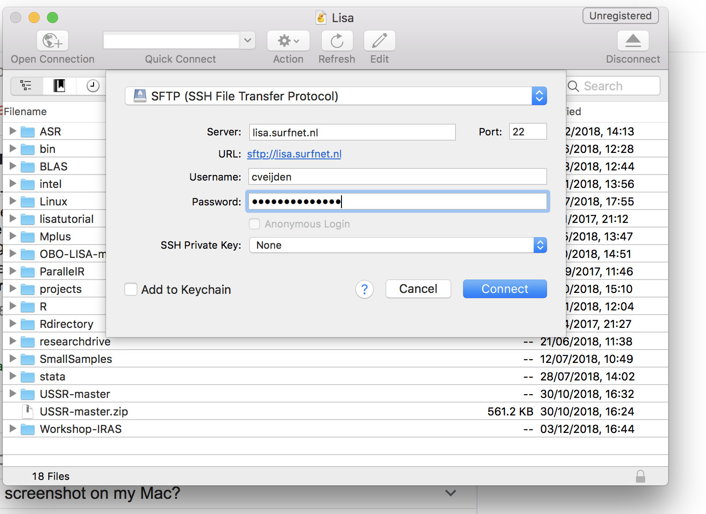

## Necessary preparations for using **Lisa**

As we said earlier, using an HPC isn't easy. You have to register your account, and install some software & packages on your computer. And, of course, learn how to use them.

### Your Lisa login

You have received your loginname and a password by email. Please change your password as instructed in the email in the [Surfnet portal](https://portal.surfsara.nl). Make sure that you can remember your password when logging in on **Lisa**. Keep in mind that the workshop teachers can't recover or reset your password.

### Install MobaXterm (for Windows users)

You need an application (tool) on your workstation to login on **Lisa**. You also need a tool to tranfer files between your local workstation and  **Lisa**. For `windows` users we recommend to install [MobaXterm](https://mobaxterm.mobatek.net).

The website of Mobatek has instructive [videos](https://mobaxterm.mobatek.net/demo.html) on how to login on a remote machine. 

Your remote host is `lisa.surfsara.nl` and you should use the login name you have received from SURFsara and the password you have entered when you have changed the original password. After you have succesfully logged in with MobaXterm, you see a command prompt in the right pane and a file browser in the left pane. In the right pane (a.k.a. _terminal pane_) you can enter commands to the **Lisa** system. The left pane you can use for uploading and downloading files.

### Install Cyberduck (for mac users)

To login at **Lisa** search with spotlight for the app `terminal`. Drag the application into the Dock. Open `Terminal` and at the command prompt ("your apple home" >) type

```
ssh your_login@lisa.surfsara.nl
```

You will be prompted for your password. If your credentials are correct the command prompt of **Lisa** will be shown. The command line syntax on **Lisa** is almost the same as the syntax on your Mac. To the user _macOS_ looks very similar to _Linux_.

To transfer files to and from **Lisa** you need a file browser. We recommend [Cyberduck] (https://cyberduck.io). After installing Cyberduck click on _Open Connection_ and fill out the form. See figure below.




### Upload course material to **Lisa**

Earlier in this workshop you have downloaded the course material to your workstation. With the new filebrowser installed (MobaXterm or Cyberduck) you can upload these files to **Lisa**. Upload the folder `Workshop-IRAS` on your workstation to **Lisa**. In MobaXterm it is easiest to upload the .zip folder as it is not possible, to upload the entire folder via the file browser in the left pane. On Lisa you can simply unzip the folder using the `unzip Workshop-IRAS.zip` command. Now, in your home directory on **Lisa** there must be a directory `Workshop-IRAS` with all the subdirectories and files. Check! 

### Editing files on **Lisa**

You probably are accustomed to using RStudio to edit your R files. With RStudio you can also edit other `text` files. On LISA there is no RStudio or any other windows oriented editors like `Notepad` or `Xcode`. Linux editors like `vim` are very versatile, but hard to learn. It would take days to master these editors. For this course we will edit all the files on your workstation.

_For macOS users:_
If you right click on a file in your Cyberduck file browser you can select `Edit with` and then select an editor. In the preferences of Cyberduck you can install a default editor (e.g. RStudio). If you save the file it will be transferred back to **Lisa**, but if you change the filename it will be stored on your workstation.

_For Windows users:_

In MobaXterm, simply double click a file in the file browser in the left pane. A **Windows** program (such as RStudio) will open to edit the file. If you save the file it will be transferred back to **Lisa**, but if you change the filename it will be stored on your workstation.


### Useful Linux commands

Although we try to avoid working on the commandline of Lisa as much as possible, it is unavoidable that you will have to use a couple of Linux commands. On internet there are lots of sites explaining the Linux commands. The most useful commands for our purpose are:

`pwd` : print current working directory

`ls` : print content of working directory

`mkdir`: make a new directory (folder)

`cd` : change to another directory (folder)

`chmod` : change the permissions of a file

`cp` : make a copy of a file

`mv` : move a file to another location and/or rename a file

`rm` : remove a file

`rmdir` : remove a directory (folder)

During the lessons we will show you some examples how to use these commands.

We also have [An introduction](./intro_linux.md). Take a while to do the exercises in this introduction

### How to install R packages on **Lisa**

On LISA many commonly used packages are pre-installed. [See this link](https://userinfo.surfsara.nl/systems/lisa/software/r). If a package isn't pre-installed, you have to do it yourself and that's on **Lisa** a little bit different than in RStudio on your workstation. The package `tidyverse` is not pre-installed, so we use this package to show you how to install R packages on **Lisa**.

At the command prompt of **Lisa** type:

```
module load R
R
```
It starts an interactive R shell and at the prompt you can type R statements. Type:

```
install.packages("tidyverse")
```

The system will ask for a CRAN mirror. Type 0 or 8. Maybe R will suggest a directory to store the packages. Confirm this suggestion. It will store the package in your user space. So it will be available with `library(tidyverse)` in subsequent R sessions.

### The next step

Now your set up to use **Lisa**. Go back to the [overview](./overview.md) or go to the next lesson [Running your first program on **Lisa**](./first_job_on_lisa.md).


