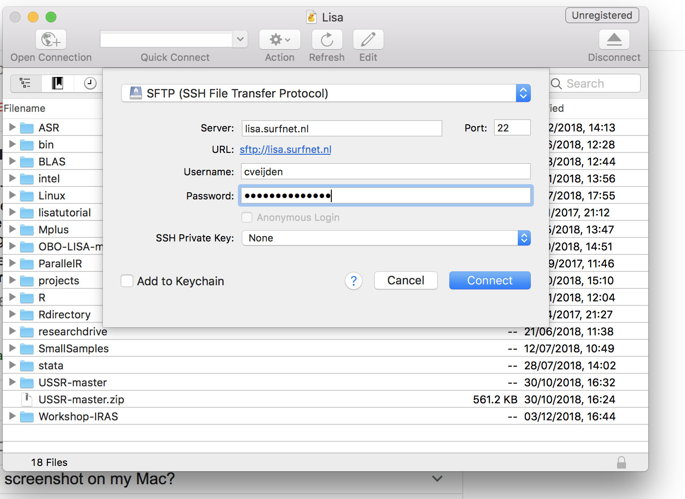

## Part One: Preparing your local workstation

In preparation for the workshop you have to register your account, and install some software & packages on your computer.

### Your Lisa login

By mail you have received your loginname and a password. Please change your password as instructed in the email. Make sure, that you can remember your password when logging in on LISA. Keep in mind that the workshop supervisor can't recover or reset your passord.

### Install MobaXterm (for Windows users)

You need an application (tool) on your workstation to login on LISA. You also have to tranfer files between your local workstation and  LISA. For `windows` users we recommend to install [MobaXterm](https://mobaxterm.mobatek.net).

The website of Mobatek has instructive [videos](https://mobaxterm.mobatek.net/demo.html) on how to login on a remote machine. 

Your remote host is `lisa.surfsara.nl` and you should use the login name you have received from SURFsara and the password you have entered when changing to original password. After you have succesfully logged in with MobaXterm, you see a command prompt in the right pane and a file browser in the left pane. In the right pane (a.k.a. terminal pane) you can enter commands to the LISA system. The left pane you can use for uploading and downloading files.

### Install Cyberduck (for mac users)

To login at LISA search with spot light for the app `terminal`. Drag the application into the Dock. Open `Terminal` and at the command prompt ("your apple home" >) type

```
ssh your_login@lisa.surfsara.nl
```

You will be prompted for your password. If your credentials are correct the command prompt of LISA will be shown. The command line syntax on LISA is almost the same as the syntax on your Mac.

To transfer files to and from LISA you need a file browser. We recommend [Cyberduck] (https://cyberduck.io). After installing Cyberduck click on _Open Connection_ and fill out the form. See figure below.




### Upload course material to LISA

Earlier on in this workshop you have downloaded the course material on your workstation. With the your new filebrowser installed (MobaXterm or Cyberduck) you can upload these files to LISA.

### Editing files on LISA

You probably are acustomed to using RStudio to edit your R files. With RStudio you can also edit other `text` files. On LISA there is no RStudio or any other windows oriented editor like `Notepad` or `Xcode`. Linux editors like `vim` are very versatile, but hard to learn. It would take days to master these editors. For this course we edit files on our workstation. 

### Useful Linux commands

Allthough we try to avoid working on the commandline of Lisa as much as possible, it is unsurmountable that, sometimes, you will have to. On internet are lots of pages explaining the Linux commands. The most useful commands for our purpose are:

`pwd` : print current working directory

`ls` : print content of working directory

`mkdir`: make a new directory (folder)

`cd` : change to another directory (folder)

`chmod` : change the permissions of a file

`cp` : make a copy of a file

`mv` : move a file to another location and/or rename a file

`rm` : remove a file

`rmdir` : remove a directory (folder)

During the sessions we will show you some examples how to use these commands.


### How to install packages in R on LISA

On LISA many commonly used packages are pre-installed. See this link. If an package isn't pre-installed, you have to do it yourself and that's on LISA not as easy as with RStudio on your workstation. The package `tidyverse` is not pre-installed, so we use this package to show you how to install R packages on LISA.


    tidyverse/dplyr/magrittr e1074, raster

### 


for Windows

for Mac

### Download course material from GitHub

All the documents and scripts belonging to this workshop are stored in a GitHub repo [Workshop-IRAS](https://github.com/UtrechtUniversity/Workshop-IRAS).

This repo is public and you can download the repository in a `.zip` file on your desktop. Sometimes your local computer will unzip the file immediately. If you are familiar with GitHub, you can also fork/clone the repo, but for this workshop it is not necessary to have these sources in a local git repo.

Install (download/unzip or clone) the content of this repo in a folder on your local workstation where you keep all the sources of your R projects. As part of the workshop you will learn how to copy these file to your account on LISA.

### R, Rscript and RStudio

In this workshop you will be running R code on both the local workstation and on LISA.
This workshop contains some assignments for which you have to run some R code on your local workstation. We assume you have fair knowledge of R. We will be using the package `tidyverse` for data manipulation. You should install this package on your workstation and also the packages `e1071` and `raster`.

```
install.packages("tidyverse")
install.packages("e1071")
install.packages("raster")
```
On LISA these packages will be pre-installed


### Assignments during workshop sessions

In the first session the assignments wil be targetted on building a program for recognizing hand-written digits. We use the [MNIST database](https://en.wikipedia.org/wiki/MNIST_database) which is widely used for training and testing in the field of machine learning. There are several machine learning techniques; we will use _support vector machines_ [SVM](https://en.wikipedia.org/wiki/Support_vector_machine).

At the beginning of the first session, you get a short introduction in Machine Learning and SVM. For the assignments it is __not__ necessary to have any knowledge of or experience with ML and SVM.


